# 架构设计 — WS Audio Demo

本文档描述三层音频处理系统的逻辑架构、模块设计、核心流程与部署方式。API 细节见 [api-spec.md](./api-spec.md)，测试见 [test-plan.md](./test-plan.md)。

---

## 1. 系统概述

用户上传 WAV（10s–300s），浏览器侧转 FLAC 并上传；Spring 编排层按块（≤90s）解码、通过 **gRPC Server Streaming** 调用 Python 做 PCM 处理（每 **10s** 一帧返回）、逐 segment 编码为 OGG-FLAC 并通过 WebSocket 推送；全部块完成后合并为完整 OGG 供下载。浏览器在收到 `segment_complete` 时解码并边播，下载进度 100% 后可任意 seek 与保存。

---

## 2. 系统上下文图（逻辑视图）

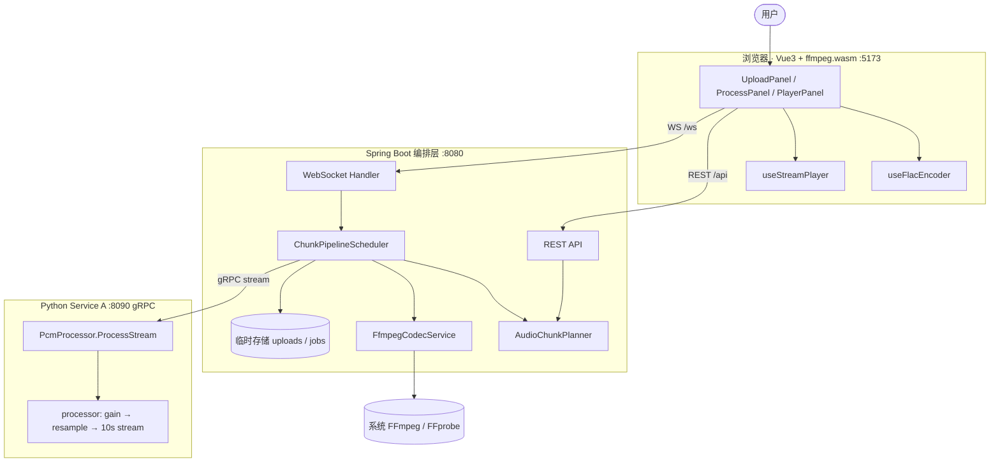

**边界原则**

| 层级 | 负责 | 不负责 |
|------|------|--------|
| 浏览器 | WAV 校验、WAV→FLAC、WS 收流、边播、双进度条、seek | 分块、PCM 算法、OGG 合并 |
| Spring | 上传、分块、FFmpeg 编解码、流水线、WS、合并、静态托管 | PCM 增益/重采样/RTF |
| Python | 24k s16 mono → 48k s16 mono、增益 clip、RTF 0.6 | 分块、文件 URI、OGG |
| FFmpeg | FLAC 解码、立体声→mono、OGG-FLAC 编码、concat | 业务状态 |

---

## 3. 部署图

### 3.1 开发环境

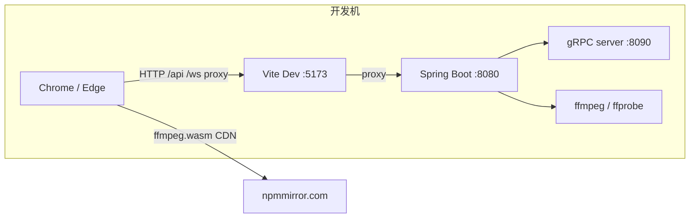

### 3.2 生产环境

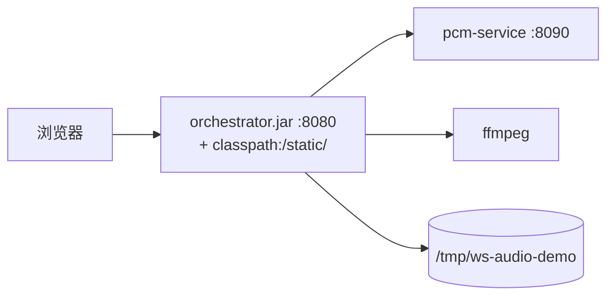

| 模式 | 前端 | 后端入口 |
|------|------|----------|
| 开发 | `pnpm dev` → `:5173` | Vite 代理 `/api`、`/ws` → `:8080` |
| 生产 | `pnpm build` → `orchestrator/.../static/` | 单 JAR `:8080` 托管 SPA + API |

构建命令：`./scripts/build-all.sh`

---

## 4. 模块与包结构

```
ws-audio-demo/
├── web/                    # Vue 3 前端
│   └── src/
│       ├── components/     # UploadPanel, ProcessPanel, PlayerPanel
│       └── composables/    # useAudioValidator, useFlacEncoder, useStreamPlayer
├── orchestrator/           # Spring Boot
│   └── com.demo.orchestrator/
│       ├── api/              # REST Controllers + DTO
│       ├── websocket/        # AudioStreamWebSocketHandler
│       ├── service/          # 业务服务
│       ├── client/           # GrpcPcmClient
│       ├── domain/           # ProcessJob, AudioChunk, StoredAudio
│       └── config/           # AppConfig, MediaProperties, SpaConfig
├── pcm-service/            # Python gRPC (app/grpc_server, servicer, processor)
├── proto/pcm/v1/pcm.proto
└── test-fixtures/          # WAV / FLAC 测试素材
```

---

## 5. 类图

### 5.1 Spring 编排层

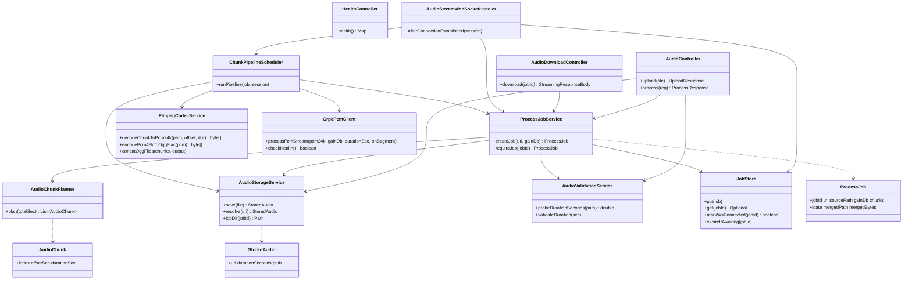

### 5.2 Python Service A

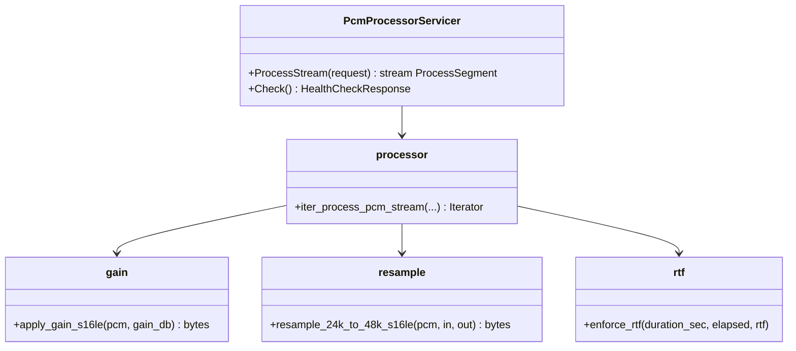

### 5.3 前端模块

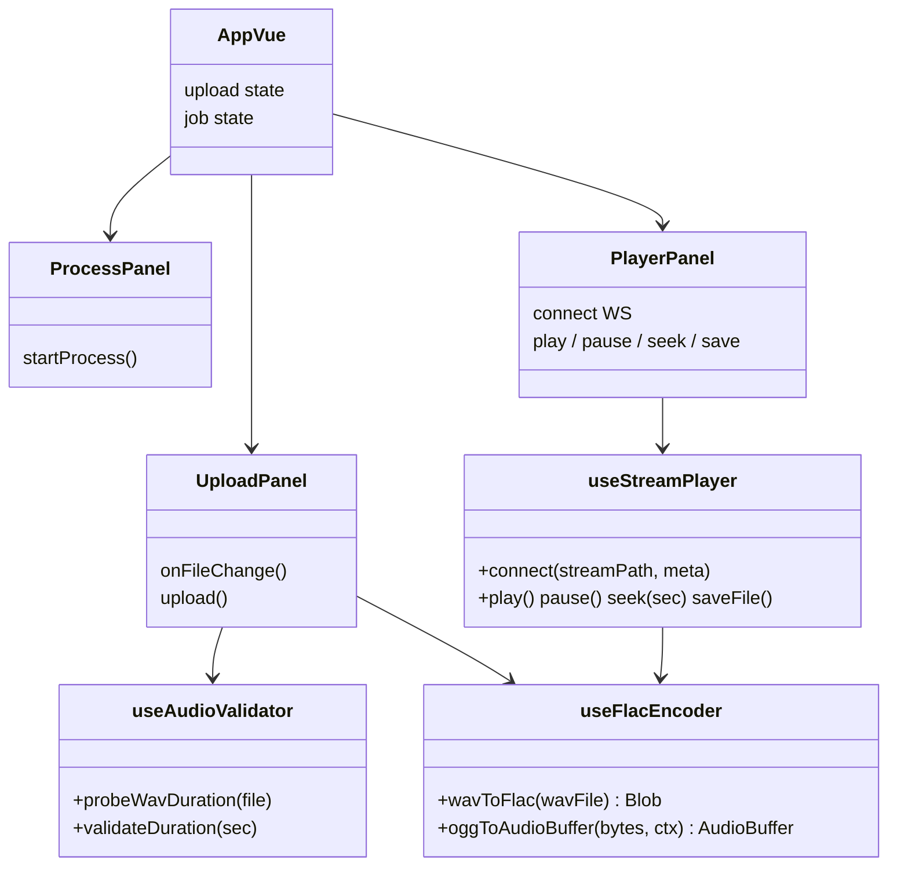

---

## 6. 领域模型与 Job 状态机

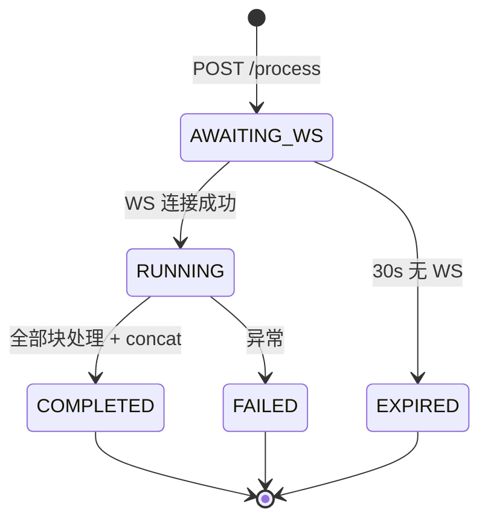

**ProcessJob 关键字段**

| 字段 | 说明 |
|------|------|
| `jobId` | UUID |
| `uri` | `audio://{uuid}` |
| `chunks` | 分块计划（index, offsetSec, durationSec） |
| `gainDb` | 默认 +6，范围 ±24 |
| `mergedPath` | concat 后的 `full.ogg` |
| `state` | AWAITING_WS → RUNNING → COMPLETED / FAILED / EXPIRED |

---

## 7. 时序图

### 7.1 上传流程

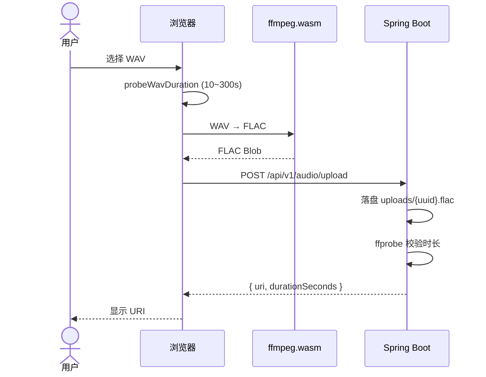

### 7.2 处理与 WS 流水线

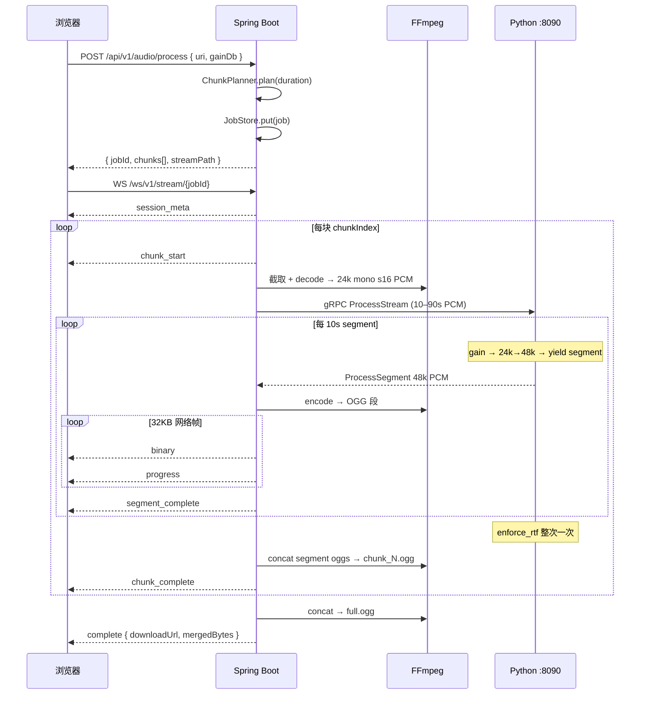

### 7.3 边播边下与完整下载

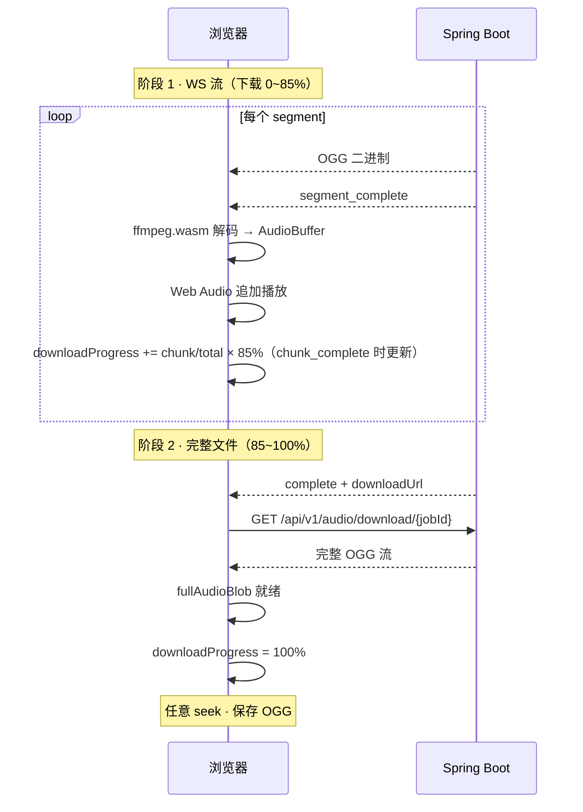

---

## 8. 流程图

### 8.1 分块规划（AudioChunkPlanner）

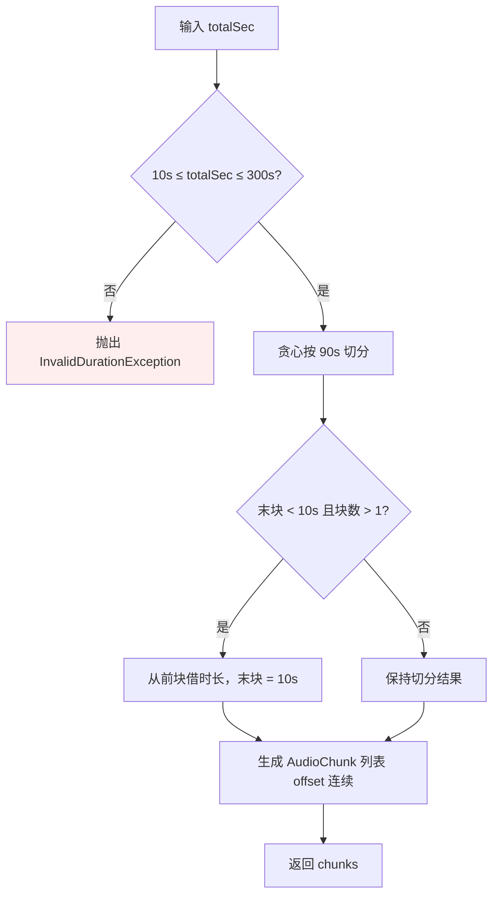

**示例**

| 总时长 | 初始切分 | rebalance 后 |
|--------|----------|--------------|
| 95s | [90, 5] | **[85, 10]** |
| 100s | [90, 10] | [90, 10] |
| 185s | [90, 90, 5] | **[90, 85, 10]** |
| 281s | [90, 90, 90, 11] | [90, 90, 90, 11] |

### 8.2 单块处理流水线

编排层 **chunk**（10–90s）与 gRPC **segment**（10s）为两层粒度：每 chunk 一次 `ProcessStream` RPC，响应按 10s 流式返回；Spring 每收到一帧即 encode → WS 推送 → 落盘 `chunk_N_seg_M.ogg`，全部 segment 完成后 concat 为 `chunk_N.ogg`。

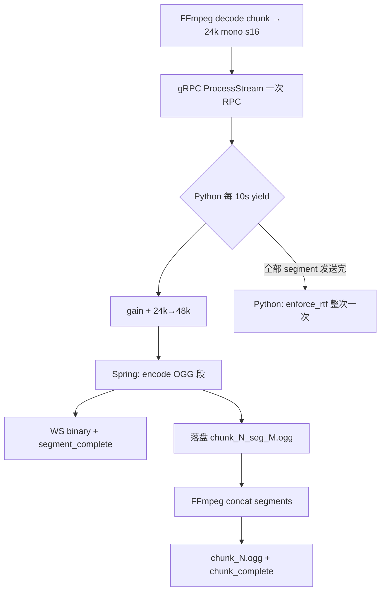

### 8.3 浏览器播放与 seek 决策

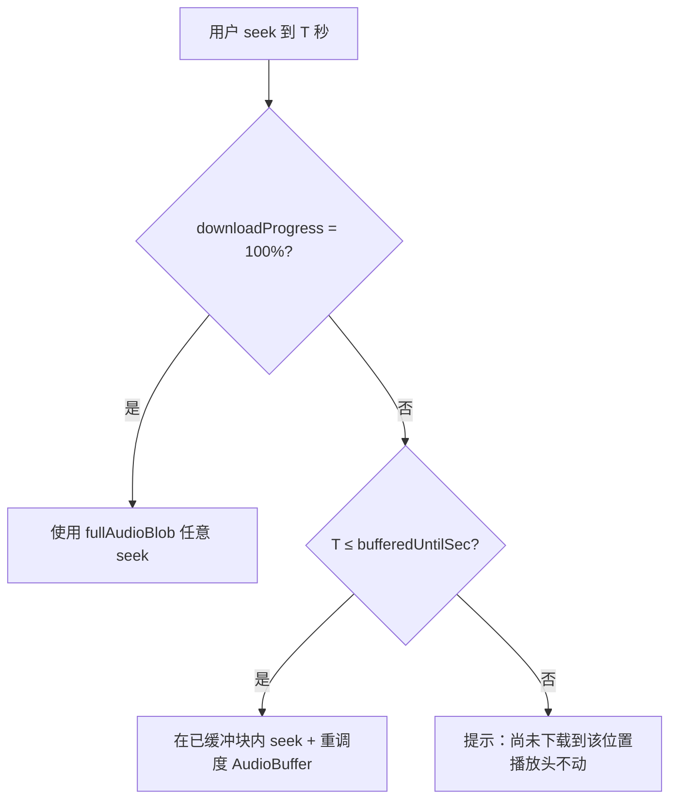

---

## 9. 数据流与存储

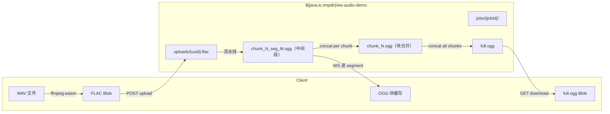

**URI 约定**：`audio://{uuid}` — 逻辑标识，不暴露服务器路径。

---

## 10. WebSocket 协议摘要

| 帧 type | 方向 | 说明 |
|---------|------|------|
| `session_meta` | S→B | totalChunks, sourceDurationSec |
| `chunk_start` | S→B | chunkIndex, offsetSec, durationSec |
| *(binary)* | S→B | 当前 **segment** 的 OGG-FLAC（32KB 切片） |
| `progress` | S→B | bytesSentInChunk, chunkBytes |
| `segment_complete` | S→B | segmentIndex, segmentDurationSec, isLastInChunk；**触发前端解码播放** |
| `chunk_complete` | S→B | 块内 segment concat 完成 |
| `complete` | S→B | downloadUrl, mergedBytes |
| `error` | S→B | message |

---

## 11. 双进度条语义

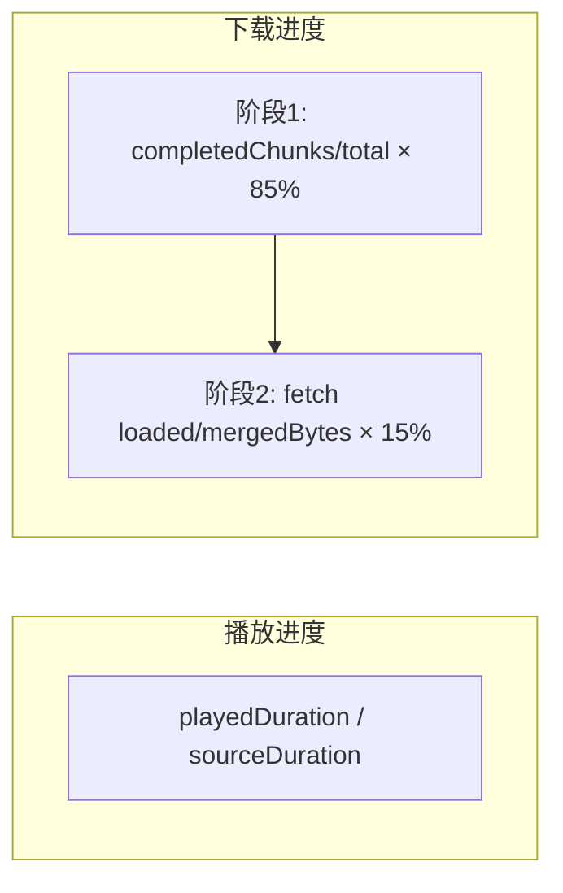

| 进度条 | 含义 | 100% 条件 |
|--------|------|-----------|
| 播放 | 已播放时长占比 | 播放到末尾 |
| 下载 | 完整可保存文件就绪 | `fullAudioBlob` fetch 完成 |

> WS 块全部收完 ≠ 下载 100%。必须拿到合并后的 `full.ogg` 才可任意 seek 与保存。

---

## 12. 分块与 RTF 时间估算

Python **仅**对 PCM 处理阶段施加 RTF 0.6（墙钟 ≥ `durationSec × 0.6`）。FFmpeg 编解码时间额外计入总墙钟，不计入 `estimatedProcessingSeconds`。

**281s 褪黑素示例**

| 指标 | 值 |
|------|-----|
| 编排分块 | [90, 90, 90, 11] → 4 chunks |
| gRPC segment 数 | 9+9+9+2 = **29**（每 chunk 内 10s 一帧） |
| estimatedProcessingSeconds | 281 × 0.6 ≈ **168.6s**（整次 Python RTF，非首段） |
| 首次可播 | 首个 `segment_complete`（约 10s 段编码 + 推送完成后，远早于首 chunk 的 54s RTF） |

---

## 13. 技术栈与依赖

| 层级 | 工具链 |
|------|--------|
| 前端 | pnpm, Vue 3, Vite, @ffmpeg/ffmpeg, npmmirror CDN |
| 编排 | Java 17+, Gradle 9.5.1 (sdkman), Spring Boot 3.4, WebSocket, gRPC (protobuf) |
| PCM | uv, grpcio, numpy, scipy |
| 系统 | **ffmpeg / ffprobe**（仅 Spring 调用） |

---

## 14. 测试与集成

| 类型 | 命令 |
|------|------|
| Python 单元 | `cd pcm-service && uv run pytest -q` |
| Spring 单元 + 集成 | `cd orchestrator && ./gradlew test` |
| 冒烟（服务已启动） | `./scripts/smoke-test.sh` |
| 全栈集成（自动启服） | `PCM_RTF=0.01 ./scripts/integration-test.sh` |

集成测试使用 `test-fixtures/flac/tone_10s_24k_mono.flac`（10s），Spring 侧 `PipelineIntegrationTest` 使用 `FakeGrpcPcmClient` 跳过 RTF 与 gRPC 网络。

---

## 15. 相关文档

- [API 规格](./api-spec.md)
- [测试计划](./test-plan.md)
- [项目状态](./PROGRESS.md)
- [README](../README.md)
